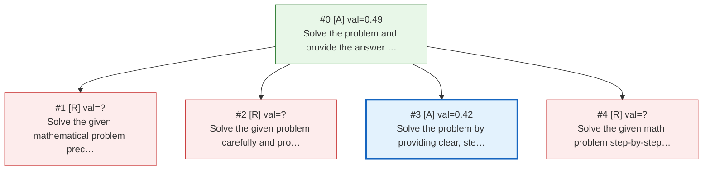

# MemV0 Tree Snapshot

- iteration: 5
- current_node_id: 3
- memory_injected_chars: 3915
- node_count: 5
- edge_count: 4

```mermaid
graph TD
  n0["#0 [A] val=0.49\nSolve the problem and provide the answer …"]
  n1["#1 [R] val=?\nSolve the given mathematical problem prec…"]
  n2["#2 [R] val=?\nSolve the given problem carefully and pro…"]
  n3["#3 [A] val=0.42\nSolve the problem by providing clear, ste…"]
  n4["#4 [R] val=?\nSolve the given math problem step-by-step…"]
  n0 --> n1
  n0 --> n2
  n0 --> n3
  n0 --> n4
  classDef accepted fill:#E8F7E8,stroke:#2E7D32,stroke-width:1px
  classDef rejected fill:#FDECEC,stroke:#C62828,stroke-width:1px
  classDef current fill:#E3F2FD,stroke:#1565C0,stroke-width:3px
  class n0 accepted
  class n1 rejected
  class n2 rejected
  class n3 accepted
  class n4 rejected
  class n3 current
```
