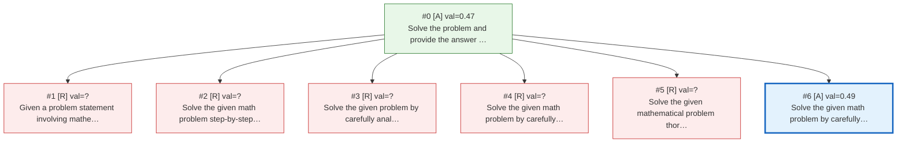

# MemV0 Tree Snapshot

- iteration: 7
- current_node_id: 6
- memory_injected_chars: 5089
- node_count: 7
- edge_count: 6

```mermaid
graph TD
  n0["#0 [A] val=0.47\nSolve the problem and provide the answer …"]
  n1["#1 [R] val=?\nGiven a problem statement involving mathe…"]
  n2["#2 [R] val=?\nSolve the given math problem step-by-step…"]
  n3["#3 [R] val=?\nSolve the given problem by carefully anal…"]
  n4["#4 [R] val=?\nSolve the given math problem by carefully…"]
  n5["#5 [R] val=?\nSolve the given mathematical problem thor…"]
  n6["#6 [A] val=0.49\nSolve the given math problem by carefully…"]
  n0 --> n1
  n0 --> n2
  n0 --> n3
  n0 --> n4
  n0 --> n5
  n0 --> n6
  classDef accepted fill:#E8F7E8,stroke:#2E7D32,stroke-width:1px
  classDef rejected fill:#FDECEC,stroke:#C62828,stroke-width:1px
  classDef current fill:#E3F2FD,stroke:#1565C0,stroke-width:3px
  class n0 accepted
  class n1 rejected
  class n2 rejected
  class n3 rejected
  class n4 rejected
  class n5 rejected
  class n6 accepted
  class n6 current
```
