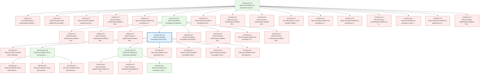

# MemV0 Tree Snapshot

- iteration: 45
- current_node_id: 15
- memory_injected_chars: 10358
- node_count: 38
- edge_count: 37

```mermaid
graph TD
  n0["#0 [A] val=0.47\nSolve the problem and provide the answer …"]
  n1["#1 [R] val=?\nYou will be given a mathematical problem …"]
  n2["#2 [R] val=?\nSolve the given math problem by providing…"]
  n3["#3 [R] val=?\nSolve the given problem carefully and pro…"]
  n4["#4 [R] val=?\nSolve the given mathematical problem care…"]
  n5["#5 [R] val=?\nSolve the given problem by providing a fu…"]
  n6["#6 [A] val=0.47\nSolve the problem thoroughly and provide …"]
  n7["#7 [R] val=?\nSolve the given mathematical problem thor…"]
  n8["#8 [R] val=?\nSolve the given mathematical problem thor…"]
  n9["#9 [R] val=?\nSolve the given mathematical problem thor…"]
  n10["#10 [R] val=?\nSolve the given problem carefully and pro…"]
  n11["#11 [R] val=?\nSolve the given mathematical problem thor…"]
  n12["#12 [R] val=?\nSolve the given mathematical problem care…"]
  n13["#13 [R] val=?\nYou will be given a math problem stated i…"]
  n14["#14 [R] val=?\nSolve the given problem by providing a cl…"]
  n15["#15 [A] val=0.51\nSolve the problem thoroughly and provide …"]
  n16["#16 [R] val=?\nSolve the problem thoroughly and present …"]
  n17["#17 [R] val=?\nSolve the given problem with a fully rigo…"]
  n18["#18 [A] val=0.49\nSolve the problem with a fully rigorous, …"]
  n19["#19 [A] val=0.47\nSolve the problem by providing a detailed…"]
  n20["#20 [R] val=?\nSolve the given mathematical problem by p…"]
  n21["#21 [R] val=?\nSolve the problem with a rigorously struc…"]
  n22["#22 [R] val=?\nSolve the given mathematical problem thor…"]
  n23["#23 [R] val=?\nSolve the given mathematical problem by p…"]
  n24["#24 [R] val=?\nSolve the problem with a fully rigorous, …"]
  n25["#25 [R] val=?\nSolve the given problem thoroughly and pr…"]
  n26["#26 [A] val=?\nSolve the problem by providing a fully ri…"]
  n27["#27 [R] val=?\nSolve the given problem by providing a co…"]
  n28["#28 [R] val=?\nSolve the problem with a fully rigorous, …"]
  n29["#29 [R] val=?\nSolve the given problem by providing a fi…"]
  n30["#30 [R] val=?\nSolve the given mathematical problem by p…"]
  n31["#31 [R] val=?\nSolve the problem with a fully rigorous, …"]
  n32["#32 [R] val=?\nSolve the problem by providing a clear, t…"]
  n33["#33 [R] val=?\nSolve the given problem thoroughly and pr…"]
  n34["#34 [R] val=?\nSolve the given problem by producing a cl…"]
  n35["#35 [R] val=?\nSolve the given mathematical problem thor…"]
  n36["#36 [R] val=?\nSolve the given mathematical problem thor…"]
  n37["#37 [R] val=?\nSolve the problem with a fully rigorous, …"]
  n0 --> n1
  n0 --> n2
  n0 --> n3
  n0 --> n4
  n0 --> n5
  n0 --> n6
  n6 --> n7
  n6 --> n8
  n6 --> n9
  n0 --> n10
  n0 --> n11
  n0 --> n12
  n0 --> n13
  n0 --> n14
  n6 --> n15
  n6 --> n16
  n15 --> n17
  n15 --> n18
  n15 --> n19
  n19 --> n20
  n15 --> n21
  n6 --> n22
  n19 --> n23
  n18 --> n24
  n15 --> n25
  n19 --> n26
  n6 --> n27
  n18 --> n28
  n0 --> n29
  n0 --> n30
  n18 --> n31
  n0 --> n32
  n15 --> n33
  n0 --> n34
  n6 --> n35
  n0 --> n36
  n15 --> n37
  classDef accepted fill:#E8F7E8,stroke:#2E7D32,stroke-width:1px
  classDef rejected fill:#FDECEC,stroke:#C62828,stroke-width:1px
  classDef current fill:#E3F2FD,stroke:#1565C0,stroke-width:3px
  class n0 accepted
  class n1 rejected
  class n2 rejected
  class n3 rejected
  class n4 rejected
  class n5 rejected
  class n6 accepted
  class n7 rejected
  class n8 rejected
  class n9 rejected
  class n10 rejected
  class n11 rejected
  class n12 rejected
  class n13 rejected
  class n14 rejected
  class n15 accepted
  class n16 rejected
  class n17 rejected
  class n18 accepted
  class n19 accepted
  class n20 rejected
  class n21 rejected
  class n22 rejected
  class n23 rejected
  class n24 rejected
  class n25 rejected
  class n26 accepted
  class n27 rejected
  class n28 rejected
  class n29 rejected
  class n30 rejected
  class n31 rejected
  class n32 rejected
  class n33 rejected
  class n34 rejected
  class n35 rejected
  class n36 rejected
  class n37 rejected
  class n15 current
```
