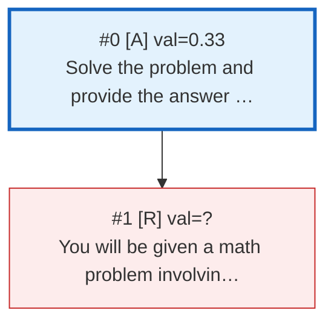

# MemV0 Tree Snapshot

- iteration: 6
- current_node_id: 0
- memory_injected_chars: 2163
- node_count: 2
- edge_count: 1

```mermaid
graph TD
  n0["#0 [A] val=0.33\nSolve the problem and provide the answer …"]
  n1["#1 [R] val=?\nYou will be given a math problem involvin…"]
  n0 --> n1
  classDef accepted fill:#E8F7E8,stroke:#2E7D32,stroke-width:1px
  classDef rejected fill:#FDECEC,stroke:#C62828,stroke-width:1px
  classDef current fill:#E3F2FD,stroke:#1565C0,stroke-width:3px
  class n0 accepted
  class n1 rejected
  class n0 current
```
